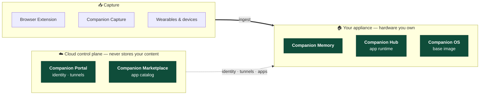

# 🧠 Companion Intelligence

[CI.Computer](https://ci.computer) · [Docs.CI.Computer](https://docs.ci.computer) · [Hub App Store](https://hub.ci.computer/store)

### [🧬 Companion Memory](https://github.com/companionintelligence/CI-Server)
A private personal database and lifelogging engine that learns your daily rhythm.
Agent Memory + API + MCP + Behavioral-Prediction Engine. [DOWNLOAD](https://ci.computer/download) Your life, secured locally.
### [🛸 Companion Hub](https://github.com/companionintelligence/CI-Hub)
Local app runtime and agent launcher. Installs and supervises marketplace apps as Docker Compose deployments on hardware you own. [DOWNLOAD](https://ci.computer/download)
### [🏪 Companion Marketplace](https://hub.ci.computer/store)
The app catalog Hub installs from self-hostable apps and agents, including first-party Companion apps and MCP servers.
### [🪐 Companion OS](https://github.com/companionintelligence/CI-OS)
The Linux base image for Companion appliance hardware.  [DOWNLOAD](https://ci.computer/download)

---

## 💡 Companion Memory Connectors

Capture, harnesses, and apps that feed or draw on Companion Memory, each one running against your own hardware, not a cloud service.

### [🖥️ Companion Capture](https://github.com/companionintelligence/CI-Capture)
Desktop capture client — screenshots, activity, and file edits, streamed to your own Companion Memory.  [DOWNLOAD](https://ci.computer/download)
### [🌐 Companion Browser Extension](https://github.com/companionintelligence/CI-Browser-Extension)
Chrome, Safari, Firefox, and Edge. Capture your browsing context to your local memory, not ours. [DOWNLOAD](https://ci.computer/download)
### [⚡ Companion Hermes](https://github.com/companionintelligence/CI-Hermes) · [🦀 Companion OpenClaw](https://github.com/companionintelligence/CI-OpenClaw)
Agent harnesses for Companion Memory.
### [🔭 Companion Atlas](https://github.com/companionintelligence/CI-Spatial-Atlas)
Your located memories on a 4D, scrubbable-through-time globe.
### [🗓️ Companion Planning](https://github.com/companionintelligence/CI-Planning)
Local-first, MCP-native todo and planning app; no cloud, no account.
### [👓 Companion OMI](https://github.com/companionintelligence/CI-OMI)
Integration for the [Omi](https://www.omi.me/) wearable — audio and activity capture over Bluetooth.
### [🕶️ Companion Mentra](https://github.com/companionintelligence/CI-Mentra) · [🛰️ Companion Even Realities](https://github.com/companionintelligence/CI-Even-Realities)
Smart-glasses app frameworks with agent routing and heads-up UI.
### [👽 Companion MaixCAM](https://github.com/companionintelligence/CI-MaixCAM)
Edge computer-vision life-logging on the Sipeed MaixCAM.
### [⌚ Companion Pebble](https://github.com/companionintelligence/CI-Pebble)
Lightweight, wrist-based triggers and alerts for Pebble Watches from your own server.
### [🎙️ Companion Home Assistant Voice PE](https://github.com/companionintelligence/CI-Home-Assistant-Voice-PE)
Ambient localized voice control over the open Wyoming Protocol to work with Home Assistant Assist

## 📡 Companion Ecosystem

### [🌟 Companion Spellbook](https://github.com/companionintelligence/CI-Spellbook) 
Our curated catalog of recommended agents, apps, and tools
### [📖 Companion Docs](https://github.com/companionintelligence/CI-Docs) 
Platform hardware and software documentation
### [🧠 Companion Active Inference](https://github.com/companionintelligence/CI-Active-Inference) 
Experimental active-inference agent implementation
### [✨ Just In Case](https://github.com/companionintelligence/JustInCase) 
Emergency offline, LLM-powered survival and preparedness guidance project
### [💫 Local Bench](https://github.com/companionintelligence/Local-Bench) 
Automated benchmark LLM performance engine on your own hardware

## 📦 Packages

- [📦 homebrew-tap](https://github.com/companionintelligence/homebrew-tap)
- [🪣 scoop-bucket](https://github.com/companionintelligence/scoop-bucket)

#### Custom Packages

- [🎨 comfy](https://github.com/companionintelligence/comfy) 
- [☎️ GonoPBX](https://github.com/companionintelligence/CI-GonoPBX)
- [🕸️ Torollo](https://github.com/companionintelligence/Torollo) 

# 🤝 Contributing
    

Each repo takes pull requests under its own license terms.

See that repo's `CONTRIBUTING.md` and `docs/License-FAQ.md`. 

Questions: [support@companionintelligence.com](mailto:support@companionintelligence.com). 

Commercial partnerships: [partner@companionintelligence.com](mailto:partner@companionintelligence.com).

---

    

    © 2026 LifeScope Inc., DBA Companion Intelligence · <a href="https://ci.computer">CI.Computer</a>

    

🐜 🐜🐜 🐜🐜🐜🍒🐜🐜 🐜🐜🍃🐜🐜🐜 🐜🐜🥬🐜🐜🐜🐜 🐜🐜🐜🌿🐜🐜  🐜🐜🐜🐜🐜🌿🐜🐜 🐜🐜🐜🍏🐜🐜 🐜🐜🐜 🐜 🐜🥬🐜🐜🐜 🐜🐜🐜🐜 🐜🍃🐜🐜🐜 🐜🐜🥬🐜🐜 🐜🐜🐜 🐜 🪲         

