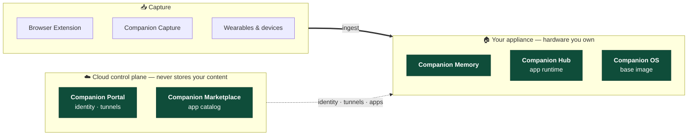

# Companion Intelligence

**A personal AI and data appliance you own.**

Companion Memory turns your own hardware into a durable, private memory and reasoning surface for your digital life. Companion Portal — our one closed-source layer — brokers identity and routes traffic to your appliance without ever seeing your content.

[ci.computer](https://ci.computer) · [docs.ci.computer](https://docs.ci.computer) · [App Store](https://companionintelligence.github.io)

---

## 📜 License

Companion Memory, Hub, Marketplace, OS, Capture, and the Browser Extension are [PolyForm Noncommercial 1.0.0](https://polyformproject.org/licenses/noncommercial/1.0.0) — free to run, fork, and modify for personal or nonprofit use. Each repo's `docs/License-FAQ.md` covers the specifics. **Companion Portal is the one exception** and stays a closed-source commercial product — it's the cloud control plane, not something you self-host.

## 🗺️ The platform in one picture

## 🏠 Appliance core

### [🧬 Companion Memory](https://github.com/companionintelligence/CI-Server)
Your life, secured locally. A private personal database and lifelogging engine — REST + GraphQL API, MCP server, and the behavioral-prediction engine that learns your daily rhythm.
### [🛸 Companion Hub](https://github.com/companionintelligence/CI-Hub)
Local app runtime and agent launcher. Installs and supervises marketplace apps as Docker Compose deployments on hardware you own. Desktop app ships via [homebrew-tap](https://github.com/companionintelligence/homebrew-tap) and [scoop-bucket](https://github.com/companionintelligence/scoop-bucket).
### [🏪 Companion Marketplace](https://github.com/companionintelligence/CI-Marketplace)
The app catalog Hub installs from — self-hostable apps and agents, including first-party Companion apps and MCP servers.
### [🪐 Companion OS](https://github.com/companionintelligence/CI-OS)
The Linux base image for Companion appliance hardware.
### [🖥️ Companion Capture](https://github.com/companionintelligence/CI-Capture)
Desktop capture client — screenshots, activity, and file edits, streamed to your own Companion Memory.
### [🌐 Companion Browser Extension](https://github.com/companionintelligence/CI-Browser-Extension)
Chrome, Safari, Firefox, and Edge. Capture your browsing context to your local memory, not ours.

## 📥 Memory connectors

Capture devices that feed Companion Memory — each one an edge onto your own hardware, not a cloud service.

### [👓 Companion OMI](https://github.com/companionintelligence/CI-OMI)
Integration for the [Omi](https://www.omi.me/) wearable — audio and activity capture over Bluetooth.
### [🕶️ Companion Mentra](https://github.com/companionintelligence/CI-Mentra) · [🛰️ Companion Even Realities](https://github.com/companionintelligence/CI-Even-Realities)
Smart-glasses app frameworks with agent routing and heads-up UI.
### [👽 Companion MaixCAM](https://github.com/companionintelligence/CI-MaixCAM)
Edge computer-vision life-logging on the Sipeed MaixCAM.
### [⌚ Companion Pebble](https://github.com/companionintelligence/CI-Pebble)
Lightweight, wrist-based triggers and alerts from your own server.
### [🎙️ Companion Home Assistant Voice PE](https://github.com/companionintelligence/CI-Home-Assistant-Voice-PE)
Ambient, localized voice control over the open Wyoming protocol — built to work *with* Home Assistant Assist, not against it.

## 📦 Third-party package republish

Distribution channels and packaging for third-party projects we build on or ship alongside Companion apps.

### [📦 homebrew-tap](https://github.com/companionintelligence/homebrew-tap) · [🪣 scoop-bucket](https://github.com/companionintelligence/scoop-bucket)
Homebrew and Scoop channels for installing Companion Hub on macOS and Windows.
### [🎨 comfy](https://github.com/companionintelligence/comfy) · [☎️ GonoPBX](https://github.com/companionintelligence/CI-GonoPBX)
ComfyUI, packaged for Companion OS and Hub · [GonoPBX](https://github.com/ankaios76/gonopbx) images, republished to our registry for the Marketplace catalog.

## 🌟 More from Companion Intelligence

- [🔭 Companion Atlas](https://github.com/companionintelligence/CI-Spatial-Atlas) — your located memories on a 4D, scrubbable-through-time globe
- [🗓️ Companion Planning](https://github.com/companionintelligence/CI-Planning) — local-first, MCP-native todo and planning app; no cloud, no account
- [📡 Companion Spellbook](https://github.com/companionintelligence/CI-Spellbook) — a curated catalog of recommended agents, apps, and tools
- [📖 Companion Docs](https://github.com/companionintelligence/CI-Docs) — hardware and software documentation
- [⚡ Companion Hermes](https://github.com/companionintelligence/CI-Hermes) · [🦀 Companion OpenClaw](https://github.com/companionintelligence/CI-OpenClaw) — agent harnesses for Companion Memory
- [🧠 Companion Active Inference](https://github.com/companionintelligence/CI-Active-Inference) — an active-inference agent implementation
- [✨ Just In Case](https://github.com/companionintelligence/JustInCase) — offline, LLM-powered survival and preparedness guidance
- [💫 Local Bench](https://github.com/companionintelligence/Local-Bench) — benchmark LLM performance on your own hardware
- [🕸️ Torollo](https://github.com/companionintelligence/Torollo) — a local, interactive playground for learning system design and networking

## 🤝 Contributing

Each repo takes pull requests under its own license terms — see that repo's `CONTRIBUTING.md` and `docs/License-FAQ.md`. Questions: [support@companionintelligence.com](mailto:support@companionintelligence.com). Commercial partnerships: [partner@companionintelligence.com](mailto:partner@companionintelligence.com).

---

© 2026 LifeScope Inc., DBA Companion Intelligence · <a href="https://ci.computer">ci.computer</a>

🐜 🐜🐜 🐜🐜🐜🍒🐜🐜 🐜🐜🍃🐜🐜🐜 🐜🐜🥬🐜🐜🐜🐜 🐜🐜🐜🌿🐜🐜  🐜🐜🐜🐜🐜🌿🐜🐜 🐜🐜🐜🍏🐜🐜 🐜🐜🐜 🐜 🐜🥬🐜🐜🐜 🐜🐜🐜🐜 🐜🍃🐜🐜🐜 🐜🐜🥬🐜🐜 🐜🐜🐜 🐜         🪲

