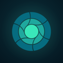
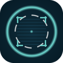
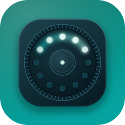
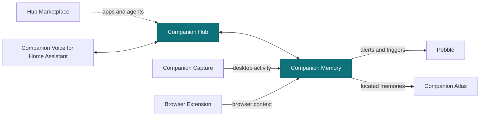

# Companion Intelligence

**Open-source tools for private, local-first AI companions.**

[Website](https://ci.computer) · [Documentation](https://docs.ci.computer) · [Marketplace](https://hub.ci.computer/store) · [All public repositories](https://github.com/orgs/companionintelligence/repositories?type=public)

Companion Intelligence is built to run on hardware you own. Companion Hub installs and runs your apps and agents, and Companion Memory is the personal data layer underneath them. The apps below add capture, spatial experiences, devices, and tools around those two.

## Apps

Find the app, then pick your platform. Every link goes to an official store listing, a GitHub release file, or a live web app. "Coming soon" means the app is not public yet.

**Companion** opens the app in the Hub Marketplace, where you install it into your own Companion Hub. **Info** opens the product page. Browse the full catalog at [hub.ci.computer/store](https://hub.ci.computer/store).

<table>
<thead>
<tr><th align="left" width="40%">App</th><th>Mobile</th><th>Desktop</th><th align="left">Web and other stores</th></tr>
</thead>
<tbody>
<tr><th colspan="4" align="left">Core</th></tr>
<tr>
<td align="left" valign="middle"><strong><a href="https://ci.computer/hub">Companion Hub</a></strong> Install and run self-hosted apps, local models, and agents on hardware you own.</td>
<td align="center" valign="middle"><a href="https://play.google.com/store/apps/details?id=com.companionintelligence.hub">Android</a> iOS: coming soon</td>
<td align="center" valign="middle"><a href="https://github.com/companionintelligence/Companion-Hub/releases/download/v0.3.9/Companion.Hub_0.3.9_aarch64.dmg">macOS&nbsp;ARM</a> <a href="https://github.com/companionintelligence/Companion-Hub/releases/download/v0.3.9/Companion.Hub_0.3.9_x64.dmg">macOS&nbsp;Intel</a> <a href="https://github.com/companionintelligence/Companion-Hub/releases/download/v0.3.9/Companion.Hub_0.3.9_x64-setup.exe">Win</a> <a href="https://github.com/companionintelligence/Companion-Hub/releases/download/v0.3.9/Companion.Hub_0.3.9_amd64.deb">Linux&nbsp;.deb</a></td>
<td valign="middle"><a href="https://hub.ci.computer/store">Companion</a> <a href="https://ci.computer/hub">Info</a></td>
</tr>
<tr>
<td align="left" valign="middle"><strong><a href="https://ci.computer/memory">Companion Memory</a></strong> A personal database that gives your local agents full context.</td>
<td align="center" valign="middle"><strong>Coming soon</strong></td>
<td align="center" valign="middle"><a href="https://github.com/companionintelligence/Companion-Memory/releases/download/desktop-v0.1.8/Companion.Memory_0.1.8_universal.dmg">macOS</a> <a href="https://github.com/companionintelligence/Companion-Memory/releases/download/desktop-v0.1.8/Companion.Memory_0.1.8_x64-setup.exe">Win</a> <a href="https://github.com/companionintelligence/Companion-Memory/releases/download/desktop-v0.1.8/Companion.Memory_0.1.8_amd64.deb">Linux&nbsp;.deb</a></td>
<td valign="middle"><a href="https://hub.ci.computer/store/ci-memory">Companion</a> <a href="https://ci.computer/memory">Info</a></td>
</tr>
<tr><th colspan="4" align="left">Capture</th></tr>
<tr>
<td align="left" valign="middle"><strong><a href="https://github.com/companionintelligence/CI-Capture">Companion Capture</a></strong> <em>(alpha)</em> Menu-bar capture client that sends screenshots and files to your own Companion Memory.</td>
<td align="center" valign="middle">—</td>
<td align="center" valign="middle"><a href="https://github.com/companionintelligence/CI-Capture/releases/download/v0.2.0-alpha.8/Companion.Capture_0.2.0-alpha.8_aarch64.dmg">macOS&nbsp;ARM</a> <a href="https://github.com/companionintelligence/CI-Capture/releases/download/v0.2.0-alpha.8/Companion.Capture_0.2.0-alpha.8_x64.dmg">macOS&nbsp;Intel</a> <a href="https://github.com/companionintelligence/CI-Capture/releases/download/v0.2.0-alpha.8/companion-capture_0.2.0-alpha.8_x64-setup.exe">Win</a> <a href="https://github.com/companionintelligence/CI-Capture/releases/download/v0.2.0-alpha.8/companion-capture_0.2.0-alpha.8_x86_64.AppImage">Linux&nbsp;AppImage</a></td>
<td valign="middle"><a href="https://ci.computer/download">Downloads</a></td>
</tr>
<tr>
<td align="left" valign="middle"><strong><a href="https://github.com/companionintelligence/CI-Browser-Extension">Browser Extension</a></strong> Capture browsing context from supported browsers into your own Companion Memory.</td>
<td align="center" valign="middle">—</td>
<td align="center" valign="middle">—</td>
<td valign="middle"><a href="https://chromewebstore.google.com/detail/companion-intelligence/bcocflgkdeimninckpmdifcniajoneih">Chrome</a> <a href="https://addons.mozilla.org/en-US/firefox/addon/companion-intelligence/">Firefox</a> <strong>Edge, Safari: coming soon</strong></td>
</tr>
<tr><th colspan="4" align="left">Spatial</th></tr>
<tr>
<td align="left" valign="middle"><strong><a href="https://atlas.ci.computer">Companion Atlas</a></strong> Turn images and video into a time-aware 3D scrapbook map.</td>
<td align="center" valign="middle">—</td>
<td align="center" valign="middle">—</td>
<td valign="middle"><a href="https://atlas.ci.computer">Web</a></td>
</tr>
<tr>
<td align="left" valign="middle"><strong><a href="https://photo.ci.computer">Photo Time Machine</a></strong> Explore photos and video as 3D memories.</td>
<td align="center" valign="middle">—</td>
<td align="center" valign="middle">—</td>
<td valign="middle"><a href="https://photo.ci.computer">Web</a></td>
</tr>
<tr>
<td align="left" valign="middle"><strong><a href="https://scan.ci.computer">Companion Scan</a></strong> Scan a room in your browser.</td>
<td align="center" valign="middle">—</td>
<td align="center" valign="middle">—</td>
<td valign="middle"><a href="https://scan.ci.computer">Web</a></td>
</tr>
<tr>
<td align="left" valign="middle"><strong><a href="https://avatar.ci.computer">Avatar Companion</a></strong> A private 3D AI agent you can customize.</td>
<td align="center" valign="middle"><a href="https://apps.apple.com/us/app/avatar-companion/id6757939947">visionOS</a></td>
<td align="center" valign="middle">—</td>
<td valign="middle"><a href="https://avatar.ci.computer">Web</a> <a href="https://hub.ci.computer/store/ci-spatial-companion-webxr">Companion</a></td>
</tr>
<tr><th colspan="4" align="left">Devices and voice</th></tr>
<tr>
<td align="left" valign="middle"><strong><a href="https://pebble.ci.computer">Companion Memory for Pebble</a></strong> Recall and ask your Companion Memory from your wrist.</td>
<td align="center" valign="middle">—</td>
<td align="center" valign="middle">—</td>
<td valign="middle"><a href="https://apps.rebble.io/en_US/application/6ae4182fb99ed900093c95f4">Rebble</a> <a href="https://pebble.ci.computer">Info</a></td>
</tr>
<tr>
<td align="left" valign="middle"><strong><a href="https://ha.ci.computer">Companion Voice for Home Assistant</a></strong> Voice integration for Home Assistant, connected to Companion Memory and Hub.</td>
<td align="center" valign="middle">—</td>
<td align="center" valign="middle">—</td>
<td valign="middle"><a href="https://hub.ci.computer/store/ci-ha-voice">Companion</a> <a href="https://ha.ci.computer">Info</a></td>
</tr>
<tr><th colspan="4" align="left">Agents and tools</th></tr>
<tr>
<td align="left" valign="middle"><strong><a href="https://hub.ci.computer/store/ci-hermes">Companion Hermes</a></strong> Hermes agent with Companion Memory integration.</td>
<td align="center" valign="middle">—</td>
<td align="center" valign="middle">—</td>
<td valign="middle"><a href="https://hub.ci.computer/store/ci-hermes">Companion</a></td>
</tr>
<tr>
<td align="left" valign="middle"><strong><a href="https://hub.ci.computer/store/ci-openclaw">Companion OpenClaw</a></strong> OpenClaw WebCLI agent for Companion Hub.</td>
<td align="center" valign="middle">—</td>
<td align="center" valign="middle">—</td>
<td valign="middle"><a href="https://hub.ci.computer/store/ci-openclaw">Companion</a></td>
</tr>
<tr>
<td align="left" valign="middle"><strong><a href="https://magic.ci.computer">Spellbook</a></strong> A catalog of local-AI and self-hosting tools.</td>
<td align="center" valign="middle">—</td>
<td align="center" valign="middle">—</td>
<td valign="middle"><a href="https://magic.ci.computer">Web</a></td>
</tr>
</tbody>
</table>

## How the pieces fit

Solid arrows show data or service flows. Dotted arrows show supporting relationships.

```mermaid
flowchart LR
    HUB["Companion Hub"] <--> MEM["Companion Memory"]
    STORE["Hub Marketplace"] -. "apps and agents" .-> HUB
    VOICE["Companion Voice for Home Assistant"] <--> HUB

    CAP["Companion Capture"] -->|"desktop activity"| MEM
    BROWSER["Browser Extension"] -->|"browser context"| MEM
    MEM -->|"alerts and triggers"| PEBBLE["Pebble"]
    MEM -->|"located memories"| ATLAS["Companion Atlas"]

    classDef core fill:#0f717a,stroke:#0b565c,color:#fff
    class HUB,MEM core
```

## Open-source projects

Developer tools and supporting projects. None of these is an app to download.

<table>
<thead>
<tr><th></th><th align="left">Project</th><th align="left">What it does</th></tr>
</thead>
<tbody>
<tr><td align="center" valign="middle">🤖</td><td valign="middle"><a href="https://github.com/companionintelligence/CI-Agent-Sync"><strong>Agent Sync</strong></a></td><td>Versionable agent configuration templates and setup notes.</td></tr>
<tr><td align="center" valign="middle">🔁</td><td valign="middle"><a href="https://github.com/companionintelligence/CI-Local-CICD"><strong>Local CI/CD</strong></a></td><td>Audit and run repository checks on local hardware.</td></tr>
<tr><td align="center" valign="middle">🧱</td><td valign="middle"><a href="https://github.com/companionintelligence/CI-Static-Containter-Builder"><strong>Static Container Builder</strong></a></td><td>Package static web apps as self-contained Docker images.</td></tr>
<tr><td align="center" valign="middle">💾</td><td valign="middle"><a href="https://github.com/companionintelligence/CI-Tools-Cache-Mounts"><strong>Cache Mounts</strong></a></td><td>Mount shared NFS caches on macOS and Linux.</td></tr>
<tr><td align="center" valign="middle">📈</td><td valign="middle"><a href="https://github.com/companionintelligence/Local-Bench"><strong>Local Bench</strong></a></td><td>Benchmark local LLM token-generation speed.</td></tr>
<tr><td align="center" valign="middle">🛟</td><td valign="middle"><a href="https://github.com/companionintelligence/JustInCase"><strong>Just In Case</strong></a></td><td>Offline emergency knowledge search. This is a research project, so do not rely on it in an emergency.</td></tr>
<tr><td align="center" valign="middle">🐳</td><td valign="middle"><a href="https://github.com/companionintelligence/CI-GonoPBX"><strong>GonoPBX images</strong></a></td><td>Build and publish GonoPBX images for the Marketplace.</td></tr>
<tr><td align="center" valign="middle">🍺</td><td valign="middle"><a href="https://github.com/companionintelligence/homebrew-tap"><strong>Homebrew tap</strong></a></td><td>Install channel for macOS desktop apps.</td></tr>
<tr><td align="center" valign="middle">🪣</td><td valign="middle"><a href="https://github.com/companionintelligence/scoop-bucket"><strong>Scoop bucket</strong></a></td><td>Install channel for Windows desktop apps.</td></tr>
</tbody>
</table>
